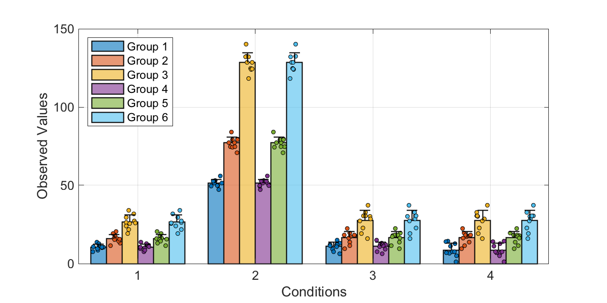

# barError

Modification bar plot to include error bars and show raw data. This script combines native MATLAB plot functions including: 
*bar*, *erorrbar*, and *scatter*. Values are provided as a cell array to handle uneven number of data points for each condition. 

### Author
David S. White 

#### Contact 
dswhite2012@gmail.com
